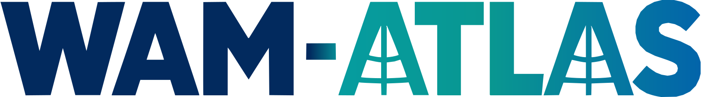
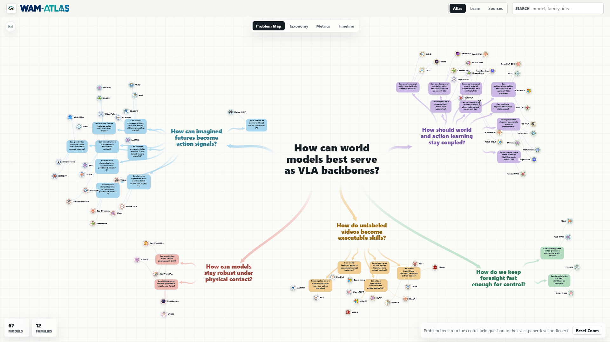

<p align="center">
  
</p>

<h1 align="center">World Action Model Atlas</h1>

<p align="center">
  <strong>An interactive map of the fast-moving world action model landscape.</strong>
</p>

<p align="center">
  <a href="https://joeclinton1.github.io/wam-atlas/">Explore the atlas</a>
  ·
  <a href="https://github.com/Joeclinton1/wam-atlas/issues">Suggest a paper or correction</a>
  ·
  <a href="#contributing">Contribute</a>
</p>

WAM Atlas is an open-source, interactive survey of **world action models (WAMs)** and **video action models** for robotics. It turns a rapidly growing body of research into something you can explore: follow the field's open problems, compare model families, inspect architecture diagrams, browse timelines and metrics, and jump straight to the primary papers.

<p align="center">
  <a href="https://joeclinton1.github.io/wam-atlas/">
    
  </a>
</p>

## What you can explore

- **Problem Map** — see how individual papers connect to the field's biggest research questions.
- **Taxonomy** — compare 12 architectural families, from pixel-space inverse dynamics to fast deployment shortcuts.
- **Metrics and Timeline** — explore progress over time and inspect normalized comparisons with their assumptions and evidence.
- **Model Cards** — open any paper for its core idea, architecture, training recipe, runtime path, limitations, and source links.
- **Generated and original diagrams** — switch between a consistent visual grammar and figures from the papers themselves.
- **Searchable sources** — find models by name, family, or idea and see uncertainty notes alongside normalized claims.

## What counts as a WAM?

The atlas includes robot policies and policy-learning pipelines where learned forward dynamics, future-state prediction, or world-model latent structure plays a central role in generating actions. The important property is not video by itself; it is whether a model predicts how the world changes under action.

Methods that only predict static geometry or 3D keypoints, without forward dynamics, are outside the current scope.

## Run it locally

The site is plain HTML, CSS, and JavaScript, so there is no build step.

```powershell
git clone https://github.com/Joeclinton1/wam-atlas.git
cd wam-atlas
python -m http.server 4173 --bind 127.0.0.1
```

Open [http://127.0.0.1:4173](http://127.0.0.1:4173).

## Project structure

| Path | Purpose |
| --- | --- |
| `index.html`, `styles.css`, `js/app.js` | The static interactive site and diagram renderer |
| `data/wam-models.json` | Curated paper metadata, insights, metrics, and model details |
| `data/diagram-profiles.json` | Renderer-compatible, paper-specific architecture profiles |
| `data/architecture-specs.json` | Stricter node-and-edge specifications for separately curated models |
| `data/original-diagrams.json` | Manifest for original paper figures |
| `methods/` | Extracted source passages used during curation |
| `assets/original-diagrams/` | Original figures and their thumbnails |
| `scripts/` | Extraction, generation, enrichment, and validation tools |

## Contributing

Contributions are very welcome. You do not need to overhaul the whole atlas to help: a well-sourced correction, a missing paper, clearer wording, an accessibility improvement, or a focused UI fix can all make the project better.

Good places to start:

- suggest a relevant missing paper or correct an existing model card;
- improve a paper's architecture, training, runtime, or uncertainty notes;
- add or improve an original-paper diagram;
- refine the taxonomy, normalized evidence, or methodology;
- fix a bug, improve accessibility, or polish the responsive interface;
- improve documentation and contributor tooling.

### Contribution workflow

1. [Open an issue](https://github.com/Joeclinton1/wam-atlas/issues) for a paper suggestion, correction, or larger change so the evidence and scope can be discussed.
2. Fork the repository and create a focused branch.
3. Make the change and preview the site locally.
4. If you changed model or diagram data, regenerate and validate the profiles:

   ```powershell
   node scripts/generate-diagram-profiles.mjs
   node scripts/validate-diagram-profiles.mjs
   ```

5. Open a pull request explaining what changed, why it belongs in the atlas, and which primary sources support it. Screenshots are especially helpful for visual changes.

### Curation principles

- Prefer the paper and official project materials over secondary summaries.
- Separate reported results from normalized estimates and make assumptions visible.
- Preserve uncertainty when the available evidence is incomplete.
- Describe the real training and inference paths; do not fill unknown internals from a family template.
- Keep pull requests focused and avoid unrelated reformatting of the large data files.

Every atlas paper has a paper-specific diagram profile. The validator checks that profiles point to local source extracts, declare their architectural core, include inputs and outputs, record training signals and runtime behavior, and render in full-card, preview, and gallery modes.

## Maintainer curation workflow

For a full paper-ingestion pass:

```powershell
.\scripts\download-missing-papers.ps1
node scripts/extract-method-sections.mjs
# Curate data/wam-models.json using the extracted primary-source evidence.
node scripts/generate-diagram-profiles.mjs
node scripts/validate-diagram-profiles.mjs
```

Abstract-level sources retain an explicit coverage level rather than having missing internals inferred from a neighboring model family.

---

If the atlas helps you understand the field, please consider sharing it, opening an issue, or contributing a paper you know well.
